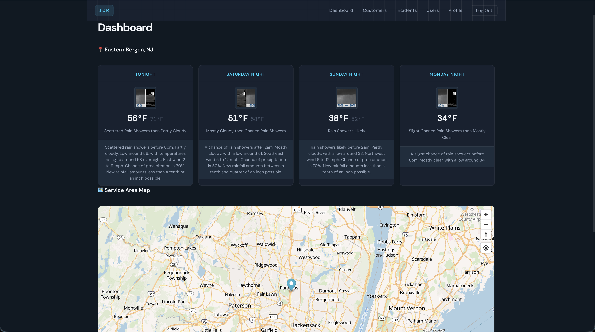
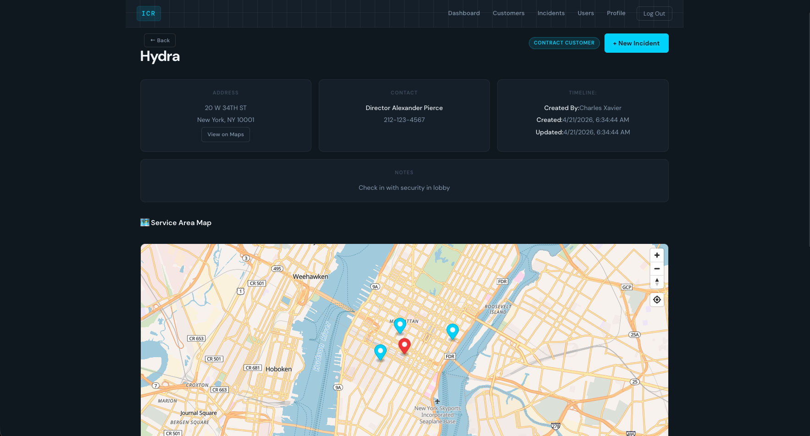
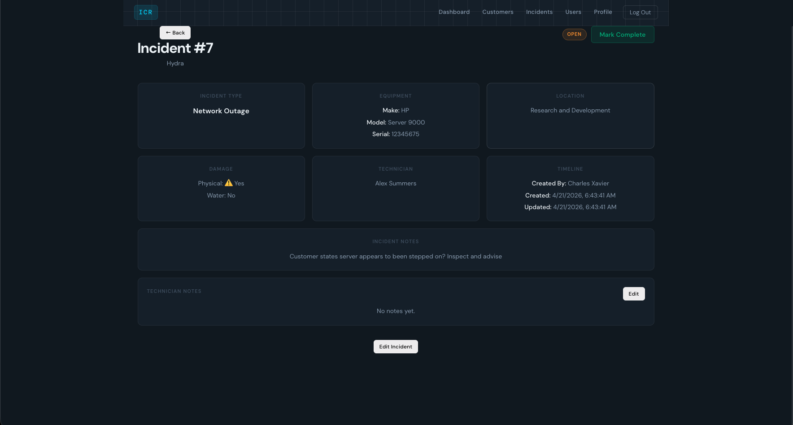
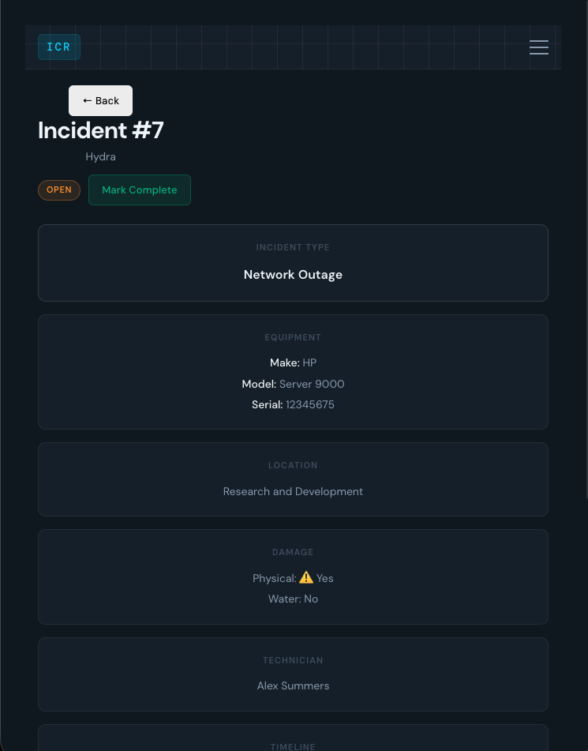

# ICR — Incident Command Response

A full-stack field service management application built for companies that install and maintain emergency communications equipment for police, fire, and EMS services.

Built as both a production-ready internal tool and a portfolio project demonstrating full-stack development from the ground up — including custom authentication, role-based access control, real-time weather, interactive mapping, and geocoding.

---

## Screenshots

### Dashboard

*Live 4-day weather forecast via the National Weather Service API, interactive service area map, and active incident summary.*

### Customer Detail

*Individual customer page with address, contact info, incident history, subsite management, and an interactive map showing the main site (red) and all associated subsites (cyan).*

### Incident Management

*Active and completed incidents displayed per customer with full technician assignment and equipment tracking.*

### Mobile View

*Fully responsive mobile layout with hamburger navigation.*

---

## Tech Stack

**Frontend**
- React 18 + Vite
- React Router v6
- MapLibre GL JS
- CSS (custom design system)

**Backend**
- Node.js + Express
- PostgreSQL (pg)
- bcrypt
- JSON Web Tokens (JWT)

**External APIs**
- National Weather Service / Weather.gov
- OpenStreetMap Nominatim (geocoding)
- OpenFreeMap (map tiles)

---

## Features

- **JWT Authentication** — Secure login with 8-hour token expiry. Protected routes on both frontend and backend.
- **Role-Based Access Control** — Three roles: `is_manager` (full access), `is_sales` (customer management), `is_service` (incident updates and tech notes). Enforced via middleware on every API route.
- **Customer Management** — Full CRUD for customers including contract status, contact info, notes, and geocoded location.
- **Subsite Management** — Each customer can have multiple associated subsites. Subsites are geocoded on creation and displayed as map markers on the customer page.
- **Incident Tracking** — Create and manage service incidents with equipment details, damage flags, technician assignment, location, and status workflow (`open` → `in_progress` → `pending` → `complete`).
- **Interactive Maps** — MapLibre GL JS maps on the dashboard, individual customer pages, and individual subsite pages. Main site and subsites rendered as distinct color-coded markers.
- **Live Weather** — 4-day weather forecast via the National Weather Service API displayed on the dashboard.
- **Geocoding** — Automatic lat/long lookup on customer and subsite creation via OpenStreetMap Nominatim.
- **User Management** — Manager-only user creation, role assignment, and soft deactivation.
- **Soft Deletes** — All records use `is_valid` boolean for deactivation rather than hard deletes, preserving historical data integrity.
- **Mobile Responsive** — Hamburger navigation and responsive layouts for field technician use on mobile devices.

---

## Architecture Decisions

**Why soft deletes?** Incidents reference customers and users via foreign keys. Hard deleting a customer or user would break historical incident records. Soft deletes via `is_valid` preserve data integrity while keeping the UI clean.

**Why JWT in localStorage?** This is a field-facing internal tool used primarily on mobile devices. HttpOnly cookies are the ideal long-term solution, but localStorage was chosen for mobile UX compatibility during initial development.

**Why COALESCE for updates?** All PATCH routes use `COALESCE($n, column_name)` in SQL, allowing partial updates without requiring the frontend to send every field on every save.

**Why separate service and route layers?** Service functions handle all database logic and never touch `req` or `res`. Route handlers handle HTTP concerns only. This keeps the codebase testable and the layers clearly separated.

---

## Getting Started

### Prerequisites
- Node.js v18+
- PostgreSQL 14+

### Clone the repo
```bash
git clone https://github.com/Pull-Push/incident_response.git
cd incident_response
```

### Backend setup
```bash
cd server
npm install
```

Create a `.env` file in the `server` directory:
```
PORT=5050
DATABASE_URL=postgresql://localhost:5432/ICR
FRONTEND_URL=http://localhost:5173
JWT_SECRET=your_jwt_secret_here
```

Create the database and run the schema:
```bash
psql -U postgres -c "CREATE DATABASE ICR"
psql -U postgres -d ICR -f schema.sql
```

Seed an initial admin user:
```bash
node seed.js
```

Start the server:
```bash
npm run dev
```

### Frontend setup
```bash
cd client
npm install
```

Create a `.env` file in the `client` directory:
```
VITE_API_URL=http://localhost:5050
```

Start the dev server:
```bash
npm run dev
```

The app will be available at `http://localhost:5173`.

---

## Project Structure

```
incident_response/
├── client/                 # React + Vite frontend
│   ├── src/
│   │   ├── components/     # Reusable components (NavBar, SiteMap, Weather, etc.)
│   │   ├── context/        # AuthContext and AuthProvider
│   │   ├── pages/          # Page-level components
│   │   └── services/       # API helper functions
│   └── vite.config.js
└── server/                 # Node + Express backend
    ├── middleware/          # authVerify, managerVerify
    ├── routes/              # Express route handlers
    ├── services/            # Database service functions
    └── server.js
```

---

## Author

**Jeff Sokol** — Software Developer  
[GitHub](https://github.com/Pull-Push)

---

## Roadmap

- [ ] Satellite/hybrid map layer toggle
- [ ] Customer weather on IndyCustomer and IndySubsite pages
- [ ] Customer portal (read-only external access)
- [ ] Audit log
- [ ] SMS/email notifications
- [ ] Export to CSV/PDF
- [ ] Token refresh and auto-logout
- [ ] Rate limiting on login route
- [ ] Reporting dashboard
